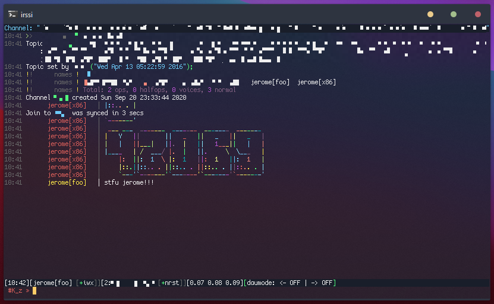

# .irssi

a quick bootstrap to get running with irssi. aimed at use with one server mainly. 

### features

- config configurator: irssi is somewhat perplexing to newer users. this takes some of the guesswork out of it by automating the creation of a sane default config, with your information inserted and ready to go. 
- tweaked theme: something of a derivative of the popular 'weed' theme sans bloat, and the 'industrial' theme. 
- goodies: figlet generator, dau/dau mode, pangotext included, so you can get right to being banned for spamming/flooding! :)
- quality-of-life goodies: tweaked statusbar will display cpu load. user names are color-coded. 

## UPDATE Oct 2020

i have replaced the `config` file, which had to be manually edited, with
a script that you can run to automatically generate a config by answering a few
simple questions!

the config generator is geared towards a one-server setup, with one main
chatroom. adding either more rooms to auto-join, or more servers, will require
manually editing the config file generated here. 

**WARNING** re-running the config generator will erase and create a new config
file!

## install 

if you have an irssi setup, either delete it or back it up: 

```
cd ~ && mv .irssi .old-irssi
```

```
cd ~ && rm -rf .irssi 
```

clone this repo to your home directory, or wherever `irssi` looks for the config:

```
cd ~
git clone https://github.com/jeromescuggs/.irssi 
```

navigate to the newly cloned directory, and run `create-config.sh`. you will be
asked for some parameters: server URL, a friendly name for the server, the
server port (default 6667), username, realname, and a chatroom to auto-join upon
connecting to a server (which will be auto-connected upon running irssi)

```
cd $HOME/.irssi
./create-config.sh
```

### config example

the following is the template used to create the first section of the config,
and is the primary section that the config generator will fill in with
information. though the $VARIABLES have different names in the script, this is
a rough idea of what it will be configuring during setup.

```
servers = (

  {
    address = "$SERVER_URL";
    chatnet = "$SERVER_NAME";
    port = "$SERVER_PORT";
    use_tls = "no";
    tls_verify = "no";
    autoconnect = "yes";
  }
);

chatnets = {
  $SERVER_NAME = {
    type = "IRC";
    nick = "$USER_NICK";
    realname = "$USER_REAL";
  }
};

channels = (
  { name = "$CHATROOM_NAME"; chatnet = "$SERVER_NAME"; autojoin = "yes"; }
);
```
